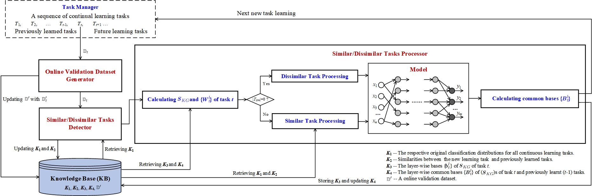

# Self-Adaptive Continual Learning with Orthogonal Weight Subspace and Knowledge Transfer

## Introduction
This repository contains the offical code for the paper 'Self-Adaptive Continual Learning with Orthogonal Weight Subspace and Knowledge Transfer'.

For continual learning (CL) of a sequence of tasks, existing research still faces challenges of both catastrophic forgetting (CF) and knowledge transfer (KT) among tasks. To deal with the challenges, we propose a novel Self-Adaptive Task Continual Learning method (SATCL). SATCL introduces a new concept: Orthogonal important Weight Subspace (OWS) of each task, and proposes a novel OWS-based task CL (TCL) strategy to avoid forgetting in a direct and efficient way. Moreover, an efficient method for computing task similarity is also proposed. When a new task is found to be similar to some previously learned tasks, SATCL automatically carries out forward and backward KT across these tasks via a contrastive loss with constraints. Equipped with a new bi-objective loss for dissimilar tasks and the above new methods, SATCL can self-adaptively performs a sequence of similar and dissimilar tasks. Extensive experiments show that our method outperforms state-of-the-art existing TCL methods.

The proposed method SATCL aims to deal with both CF and KT well in its CL lifespan. To this end, it contains three  components embedded in some novel techniques with a KB shown in the following figure, i.e., Online Validation Dataset Generator, Similar/Dissimilar Tasks Detector, and Dissimilar/Similar Tasks Processor.



## Environments

```bash
conda create -n [your_env_name] python=3.8
conda activate [your_env_name]
pip install -r requirements.txt
```

## Training and Testing

In the following, we show how to train and test the proposed method SATCL on five different datasets for continual learning.

### PMNIST

```bash
python main_pmini.py
```

### CIFAR-100

```bash
python main_cifar100.py
```

### CIFAR-100 Superclass

```bash
python main_cifar100_sup.py
```

### MiniImageNet

```bash
python main_mini_imagenet.py
```

### Five-Datasets

```bash
python main_five_datasets.py
```

The parameter settings can be modified in each 'main_*.py' file. You can view the parameter descriptions in each file. The continual learning results will be printed on the terminal.

## Datasets
The data files are not included in the repository because they are too large. When you run the 'main_*.py' files, they will automatically download the data files from the internet and save them in this directory.


